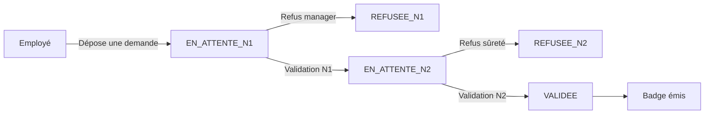

<div align="center">

# SIGBA — Système de Gestion des Badges et Accès

**Projet de stage · Royal Air Maroc**

Gestion complète du cycle de vie des badges d'accès des salariés : demande,
double validation, émission, incidents et habilitations de zones.


---

</div>

## Sommaire

- [Fonctionnalités](#fonctionnalités)
- [Stack technique](#stack-technique)
- [Prérequis](#prérequis)
- [Installation](#installation)
  - [Backend](#backend)
  - [Frontend](#frontend)
- [Démarrage](#démarrage)
- [Structure du projet](#structure-du-projet)
- [Rôles & workflow métier](#rôles--workflow-métier)
- [API & documentation](#api--documentation)

---

## Fonctionnalités

| | |
|---|---|
| **Demande de badge** | En ligne, avec pièces justificatives et zones demandées |
| **Double validation** | N1 par le manager de direction, N2 par un agent de sûreté |
| **Émission de badge** | UID unique, expirations et renouvellements |
| **Gestion des incidents** | Perte, vol, fin de contrat — suspension, levée, révocation |
| **Habilitations de zones** | Attribuées au badge |
| **Notifications** | Temps réel par rôle (manager, agent de sûreté, employé) |
| **Invitations** | Création des comptes employés par email (via Keycloak) |
| **Tableaux de bord** | Manager, employé, sûreté |
| **Passages** | Consultations et simulation d'accès aux zones |

## Stack technique

| Couche | Technologie |
|---|---|
| Backend | Spring Boot 4.1 · Java 21 · Spring Security OAuth2 · JPA / Hibernate |
| Frontend | React 19 · Vite · Tailwind CSS v4 · Base UI · shadcn |
| Base de données | PostgreSQL |
| Authentification | Keycloak (OAuth2 / JWT) |

## Prérequis

| Outil | Version |
|---|---|
| JDK | 21 |
| Maven | 3.9+ (ou `./mvnw`) |
| Node.js | 20+ |
| PostgreSQL | 15 |
| Keycloak | 26+ (realm `sigba-realm`) |

## Installation

### Backend

#### 1. Base de données

Créez la base (ou importez le dump fourni dans `backups/`) :

```sql
CREATE DATABASE sigba_db;
```

#### 2. Variables d'environnement

```bash
cd backend
cp .env.example .env
```

| Variable | Description |
|---|---|
| `DB_URL` | JDBC URL PostgreSQL |
| `DB_USER` / `DB_PASS` | Identifiants PostgreSQL |
| `KEYCLOAK_ISSUER` | `http://localhost:8080/realms/sigba-realm` |
| `KEYCLOAK_SERVER_URL` | URL du serveur Keycloak |
| `KEYCLOAK_REALM` | `sigba-realm` |
| `KEYCLOAK_CLIENT_ID` | `sigba-frontend` |
| `MAIL_HOST` / `MAIL_PORT` / `MAIL_USER` / `MAIL_PASS` | SMTP (ex. Mailtrap en dev) |

#### 3. Keycloak

- Créer le realm `sigba-realm` et le client `sigba-frontend` (type `public`).
- Rôles définis dans le realm : `EMPLOYE`, `MANAGER`, `AGENT_SURETE`, `SUPER_ADMIN`.

### Frontend

```bash
cd frontend
npm install
```

Créez `.env` à la racine du dossier `frontend/` :

```env
VITE_KEYCLOAK_URL=http://localhost:8080
VITE_KEYCLOAK_REALM=sigba-realm
VITE_KEYCLOAK_CLIENT_ID=sigba-frontend
VITE_KEYCLOAK_CLIENT_SECRET=<secret du client Keycloak>
```

> Les variables `VITE_*` sont exposées au navigateur.

## Démarrage

Prérequis : **Keycloak** sur le port 8080 et **PostgreSQL** sur le port 5432.

### Backend — port 8081

```bash
cd backend
./mvnw spring-boot:run
```

> Les données initiales sont insérées automatiquement au premier démarrage
> (`schema.sql` / `data.sql`).

### Frontend — port 5173

```bash
cd frontend
npm run dev
```

> Accédez à `http://localhost:5173` puis connectez-vous via Keycloak.

## Structure du projet

```
rambadge/
├── backend/                    # Spring Boot (API REST)
│   ├── src/main/java/ma/ram/sigba/
│   │   ├── controller/         # Contrôleurs REST
│   │   ├── service/            # Logique métier
│   │   ├── repository/         # Accès données (JPA)
│   │   ├── entity/             # Entités + enums
│   │   ├── dto/                # Objets de transfert
│   │   ├── config/             # Sécurité, CORS, Keycloak
│   │   ├── exception/          # Gestion des erreurs
│   │   ├── util/               # Helpers
│   │   └── validation/         # Validations métier
│   ├── src/main/resources/
│   │   ├── application.properties
│   │   ├── schema.sql          # Schéma initial
│   │   └── data.sql            # Données seed
│   ├── .env.example
│   └── pom.xml
├── frontend/                   # React (SPA)
│   ├── src/
│   │   ├── components/ui/      # Composants shadcn / Base UI
│   │   ├── features/           # Modules métier (badges, demandes…)
│   │   ├── api/ services/      # Client API
│   │   ├── context/ store/     # État global
│   │   ├── hooks/ lib/         # Utilitaires
│   │   └── App.jsx             # Routage
│   ├── package.json
│   └── vite.config.js
└── backups/                    # Dumps DB + scripts (non versionné)
```

## Rôles & workflow métier

### Rôles

| Rôle | Périmètre |
|---|---|
| `EMPLOYE` | Dépose une demande de badge, suit ses badges et incidents, consulte les notifications |
| `MANAGER` | Valide (N1) les demandes de sa direction, gère les incidents, invite des comptes |
| `AGENT_SURETE` | Valide (N2), émet / renouvelle les badges, gère incidents, habilitations et passages |
| `SUPER_ADMIN` | Administration complète |

### Cycle de vie d'une demande



Statuts de badge : `EN_ATTENTE` · `ACTIF` · `SUSPENDU` · `REVOQUE` · `EXPIRE`

### Incidents

Types : `PERTE` · `VOL` · `FIN_CONTRAT` — Statuts : `PROGRAMME` · `SUSPENDU` · `REVOQUE` · `LEVE`

- Un badge ne peut avoir qu'un seul incident en cours.
- `FIN_CONTRAT` déclenche la révocation du badge (non levable).
- `PERTE` / `VOL` suspendent le badge ; la levée le réactive après signalement.

## API & documentation

### Endpoints principaux

| Méthode | Endpoint | Description |
|---|---|---|
| `GET` | `/api/auth/me` | Utilisateur connecté |
| `GET` / `POST` | `/api/demandes` | Lister / créer une demande |
| `GET` | `/api/demandes/en-attente-n1` | Demandes en attente N1 |
| `POST` | `/api/demandes/{id}/validate-n1` · `refuse-n1` | Décision N1 |
| `POST` | `/api/demandes/{id}/validate-n2` · `refuse-n2` | Décision N2 |
| `GET` / `POST` | `/api/badges` | Lister / émettre un badge |
| `GET` | `/api/badges/uid/{uid}` | Recherche par UID |
| `GET` / `POST` | `/api/incidents` | Lister / signaler un incident |
| `PUT` | `/api/incidents/{id}/lever` | Lever un incident |
| `GET` | `/api/notifications` | Notifications de l'utilisateur connecté |
| `GET` | `/api/notifications/unread-count` | Compteur de non lues |
| `GET` / `POST` | `/api/invitations` | Lister / inviter un employé |
| `POST` | `/api/invitations/{code}/accept` | Accepter une invitation |
| `GET` | `/api/dashboard/*` | Stats par rôle (manager, sûreté, employé, super-admin) |
| `GET` / `POST` | `/api/passages` · `/api/passages/simulate` | Passages et simulation d'accès |
| `GET` / `POST` | `/api/employes` · `/api/directions` · `/api/managers` · `/api/zones` · `/api/postes` · `/api/agents-surete` | CRUD référentiels |

> Liste non exhaustive — voir `backend/src/main/java/ma/ram/sigba/controller/`.

### Swagger / OpenAPI

La documentation interactive est générée par Springdoc :

```
http://localhost:8081/swagger-ui.html
```

Tous les endpoints sont protégés par JWT (Keycloak) ; les rôles sont extraits du token.
